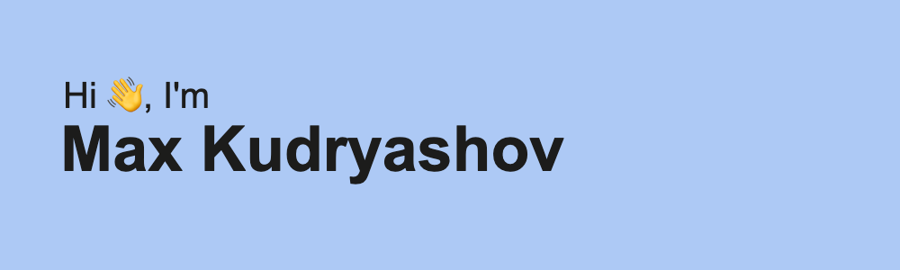
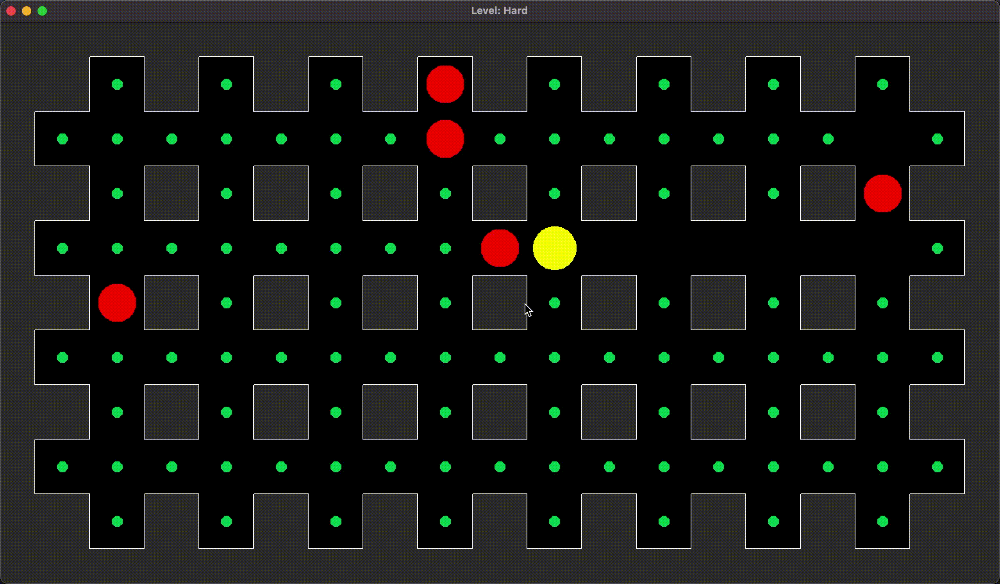
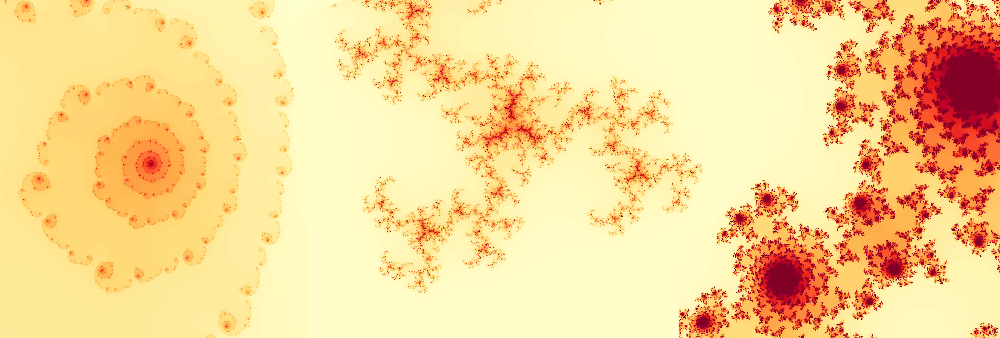

<!--  -->

<!--
**kudrmax/kudrmax** is a ✨ _special_ ✨ repository because its `README.md` (this file) appears on your GitHub profile.

Here are some ideas to get you started:

- 🔭 I’m currently working on ...
- 🌱 I’m currently learning ...
- 👯 I’m looking to collaborate on ...
- 🤔 I’m looking for help with ...
- 💬 Ask me about ...
- 📫 How to reach me: ...
- 😄 Pronouns: ...
- ⚡ Fun fact: ...
-->

# Привет, меня зовут Макс Кудряшов!

Программирую на C++ и Python.
Обучаюсь на 3 курсе в НИУ ВШЭ на направлении "Прикладная математика".

[Telegram](t.me/kudrmax)

# Проекты

## [1. Wave Function Collapse Simulation](https://github.com/kudrmax/wfc)

Симуляция алгоритма волнового коллапса (WFC) для создания уникальных случайно сгенерированных паттернов на 2D-сетках.

Stack: `C++`, `SFML`

## [2. Pacman game](https://github.com/kudrmax/pac-man)

Игра на основе существующей игры PacMan, созданная на языке C++ с визуализацией через SFML, с целью практики в ООП,
паттернах (таких как state, compose, prototype и др.) и SFML.

Stack: `C++`, `SFML`, различные паттерны

## [3. Graph class](https://github.com/kudrmax/graph)

Создание собственного класса Graph, с целью отработки использования стандартных контейнеров из `STL`.

Stack: `C++`, `STL`

## [4. Эффективное использование Python для решения задач прикладной математики](https://github.com/kudrmax/applied-mathematics-python)

Описание третьего проекта

Stack: `Python`, `Numba`, `NumPy`

