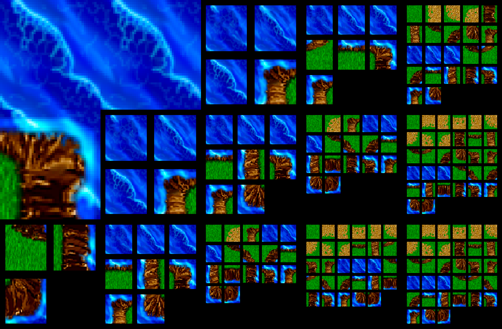
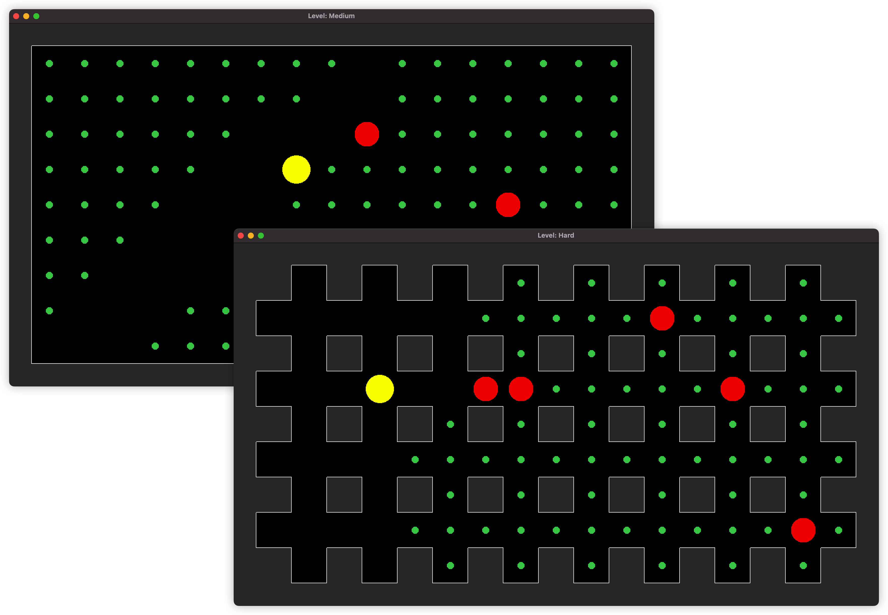
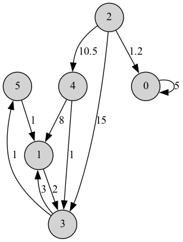

# Привет, меня зовут Макс Кудряшов!

Программирую на C++ и Python.
Обучаюсь на 3 курсе в НИУ ВШЭ на направлении "Прикладная математика".

[Telegram](t.me/kudrmax)

# Проекты

## [Wave Function Collapse Simulation](https://github.com/kudrmax/wfc)

`C++`, `SFML`

Симуляция алгоритма волнового коллапса (WFC) для создания уникальных случайно сгенерированных паттернов на 2D-сетках.

## [Pacman game](https://github.com/kudrmax/pac-man)

`C++`, `SFML`, различные паттерны

Игра на основе существующей игры PacMan, созданная на языке C++ с визуализацией через SFML, с целью практики в ООП,
паттернах (таких как state, compose, prototype и др.) и SFML.

## [Graph class](https://github.com/kudrmax/dijkstra)

`C++`, `Google Tests`

- Создание собственного класса Graph.
- Реализация алгоритма Дейкстры для нахождение кратчайшего расстояние между двумя вершинами.

| Граф                                                            | Кратчайший путь                                                 |
|-----------------------------------------------------------------|-----------------------------------------------------------------|
| 

 | 

 |

## [Python для решения задач прикладной математики на Python](https://github.com/kudrmax/applied-mathematics-python)

`Python`, `Numba`, `NumPy`, `Matplotlib`

